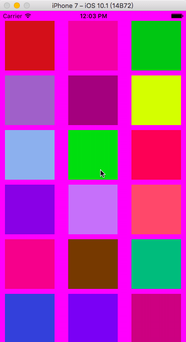

# HLUIColorExtension
This is a extension for UIColor, implement random color, and convert hex string to RGB.

## The Effect


## How to use
Download the Demo, and drag `UIColorExtension.swift` file to your project.

```swift
view.backgroundColor = UIColor(r: 50, g: 150, b: 200)
view.backgroundColor = UIColor(hex: "0xFC6200")
view.backgroundColor = UIColor.randomColor()
```